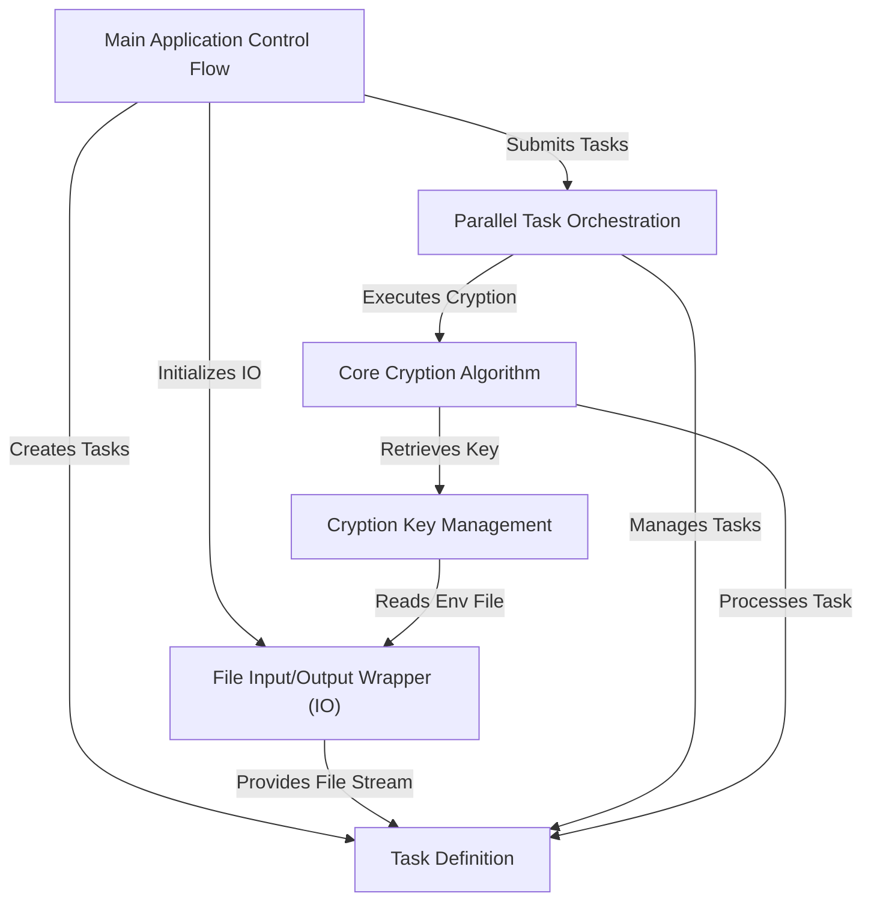
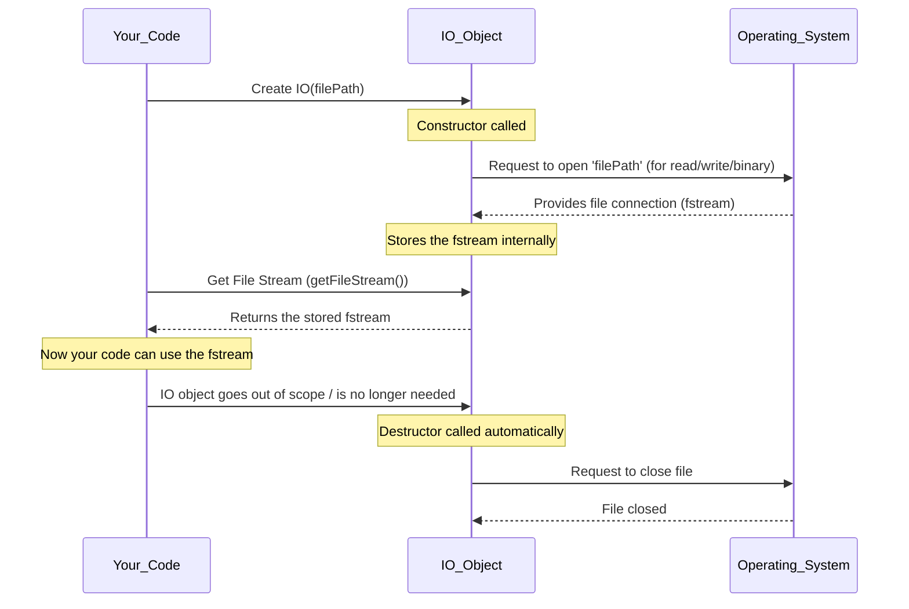
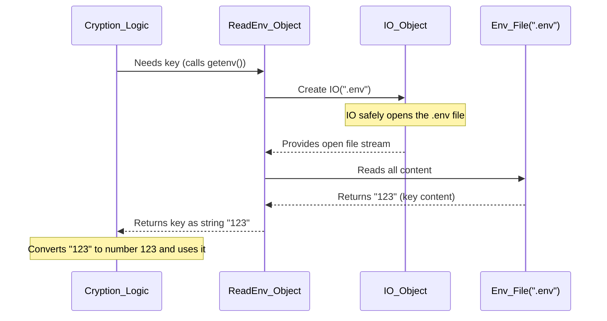
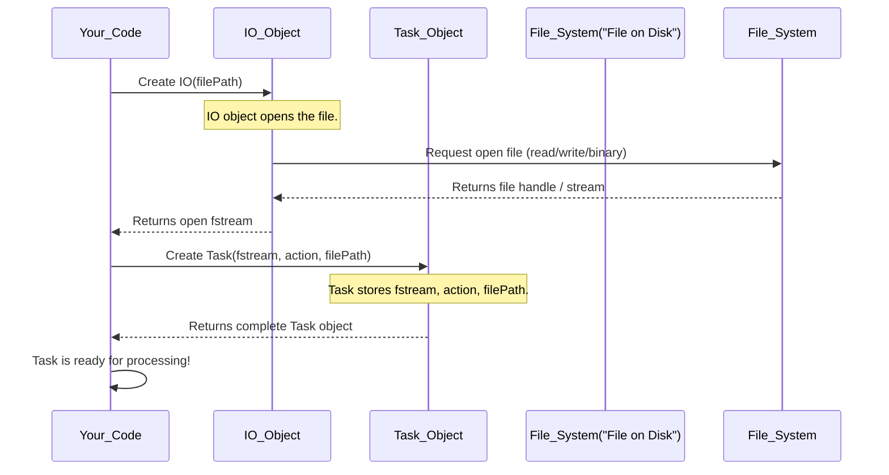
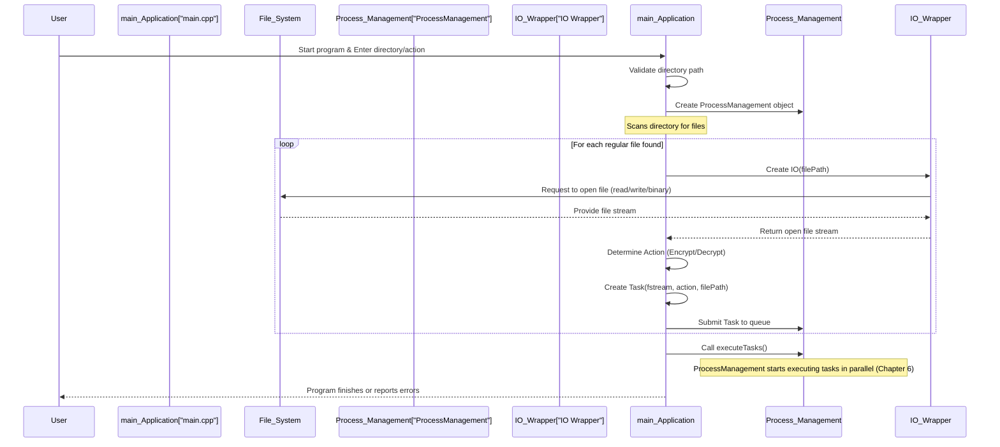
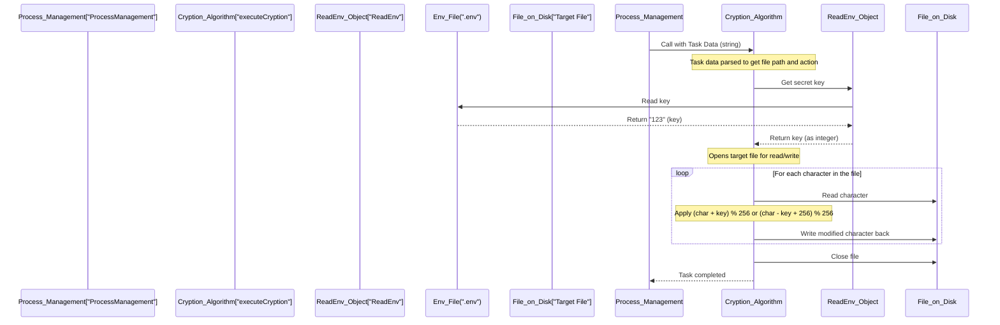
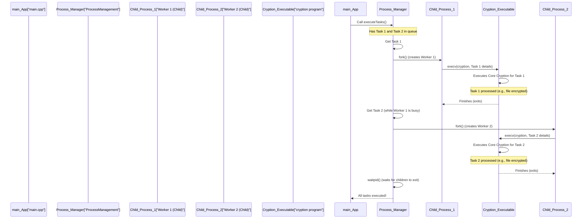

# Overview

This project is a C++ application that enables *fast* **encryption** and **decryption** of files within a specified directory. It significantly speeds up these operations by processing multiple files *concurrently* using **parallel computing techniques**.

## Visual Overview



## Chapters

1. [File Input/Output Wrapper (IO)](#chapter-1-file-inputoutput-wrapper-io)  
2. [Cryption Key Management](#chapter-2-cryption-key-management)  
3. [Task Definition](#chapter-3-task-definition)  
4. [Main Application Control Flow](#chapter-4-main-application-control-flow)  
5. [Core Cryption Algorithm](#chapter-5-core-cryption-algorithm)  
6. [Parallel Task Orchestration](#chapter-6-parallel-task-orchestration) 

---

# Chapter 1: File Input/Output Wrapper (IO)

Welcome to the `encrypty` project! In this first chapter, we're going to explore a fundamental building block of our application: the **File Input/Output Wrapper (IO)**. Don't let the fancy name scare you – it's actually a very helpful tool that makes working with files much simpler and safer.

### Why do we need a "File Input/Output Wrapper"?

Imagine you have a huge library, and you want to borrow a specific book. You wouldn't just run into the stacks yourself, search for it, and then try to figure out how to properly check it out and return it. Instead, you'd go to a **librarian**. You tell the librarian which book you want, and they handle all the details: finding the book, getting it ready for you, and making sure it's properly put back when you're done.

In the world of computer programs, working with files is a bit like that. When a program wants to read from a file (Input) or write to a file (Output), it needs to:
1.  **Open** the file.
2.  Make sure the file is **ready** for reading or writing.
3.  Do the actual reading or writing.
4.  **Close** the file when done.

If we don't handle these steps carefully, especially closing files, we can run into problems. Files might get corrupted, or other programs might not be able to access them.

This is where our **IO Wrapper** comes in! It acts as that specialized librarian for your files. Its main job is to centralize all these file handling tasks, so you don't have to worry about the details every single time you touch a file.

Let's look at a simple use case: opening a file to either encrypt or decrypt its contents. Instead of manually opening and closing files everywhere, we'll use our `IO` wrapper.

### How to use the `IO` Wrapper

The `IO` wrapper is designed to be super easy to use. You simply tell it which file you want to work with, and it gives you a ready-to-use "file stream" (think of it as a direct pathway to read or write the file's content).

Here's how you might use it in our `encrypty` application, for example, when we're trying to process many files in a directory:

```cpp
// ... inside main.cpp, simplified for clarity ...
std::string filePath = "my_secret_document.txt"; // Imagine this is a file found in a directory

// 1. Create an IO object (our librarian) and tell it which file path to manage.
IO io(filePath);

// 2. Ask the IO object for the "file stream" (the open book).
std::fstream f_stream = std::move(io.getFileStream());

// 3. Check if the file was opened successfully.
if (f_stream.is_open()) {
    // Now you can read from or write to 'f_stream'
    // For example, prepare it for encryption/decryption
    // ...
} else {
    std::cout << "Unable to open file: " << filePath << std::endl;
}
```

In this snippet, `IO io(filePath);` is the key. You provide the file path, and the `IO` object takes care of trying to open it. Then, `io.getFileStream();` gives you the actual open file connection.

Another example can be seen when reading configuration from a `.env` file:

```cpp
// ... inside src/app/fileHandling/ReadEnv.cpp, simplified ...
std::string env_path = ".env";

// Create an IO object for the .env file
IO io(env_path);

// Get the file stream
std::fstream f_stream = io.getFileStream();

// Now read its content
std::stringstream buffer;
buffer << f_stream.rdbuf(); // Read everything from the file stream into a buffer
std::string content = buffer.str();

// ... 'content' now holds the text from the .env file ...
```

As you can see, the usage pattern is consistent: create an `IO` object with a file path, then retrieve the stream. This keeps our code clean and reliable because the `IO` wrapper handles the complicated parts.

### What happens behind the scenes?

Let's peek behind the curtain to see how our `IO` librarian works.

When you create an `IO` object with a file path, it immediately tries to open that file. It stores the connection to the file internally. When the `IO` object is no longer needed (for example, when your program finishes using it), it automatically closes the file, ensuring everything is cleaned up properly. This is like the librarian making sure the book is returned to the shelf correctly.

Here's a simplified sequence of events:



### Diving into the Code

Let's look at the actual C++ code for our `IO` wrapper.

**1. The Constructor (`IO::IO(...)`)**

This is the part of the `IO` object that runs when you create it (e.g., `IO io(filePath);`).

```cpp
// src/app/fileHandling/IO.cpp
#include <iostream>
#include "IO.hpp" // Our IO header file

IO::IO(const std::string& file_path) {
    // Try to open the file with these modes:
    // std::ios::in  - for reading
    // std::ios::out - for writing
    // std::ios::binary - for raw data (important for encryption!)
    file_stream.open(file_path, std::ios::in | std::ios::out | std::ios::binary);

    // Check if the file actually opened.
    if (!file_stream.is_open()) {
        std::cout << "Unable to open file: " << file_path << std::endl;
    }
}
```

*   `file_stream.open(...)`: This is the crucial line. It attempts to open the file specified by `file_path`.
*   `std::ios::in | std::ios::out | std::ios::binary`: These are "flags" that tell the operating system *how* we want to open the file. We want to be able to both `in` (read) and `out` (write), and treat it as a `binary` file (meaning we deal with raw bytes, not just text, which is perfect for encryption!).
*   `if (!file_stream.is_open())`: This checks if the file opening was successful. If not, it prints an error message.

**2. Getting the File Stream (`IO::getFileStream()`)**

Once the `IO` object has successfully opened the file and stored its stream, you can ask for it using this function:

```cpp
// src/app/fileHandling/IO.cpp
#include "IO.hpp" // Our IO header file
// ... other parts of IO.cpp ...

std::fstream IO::getFileStream() {
    // std::move is a special C++ trick to efficiently transfer ownership
    // of the 'file_stream' from the IO object to the caller.
    // The IO object will no longer manage this specific stream.
    return std::move(file_stream);
}
```

*   `std::move(file_stream)`: This is an advanced C++ feature. In simple terms, it "moves" the internal file stream out of the `IO` object and gives it directly to the part of your code that called `getFileStream()`. This is more efficient than copying large file streams and ensures that only one part of the program is responsible for handling the active file connection at any given time.

**3. The Destructor (`IO::~IO()`)**

This special function runs automatically when an `IO` object is no longer needed. Its job is to clean up resources, like making sure files are properly closed.

```cpp
// src/app/fileHandling/IO.cpp
#include <iostream>
#include "IO.hpp" // Our IO header file
// ... other parts of IO.cpp ...

IO::~IO() {
    // Before the IO object disappears, if the file is still open, close it.
    if (file_stream.is_open()) {
        file_stream.close();
    }
}
```

*   `if (file_stream.is_open()) { file_stream.close(); }`: This ensures that if the file stream is still active when the `IO` object is destroyed, it will be properly closed. This prevents "resource leaks" where files remain open even after your program is done with them.

### Conclusion

In this chapter, we've introduced the **File Input/Output Wrapper (IO)**. We learned that it acts like a dedicated librarian for your files, handling the complex tasks of opening, managing, and closing file streams. By using the `IO` wrapper, our `encrypty` application can interact with files consistently, safely, and with much cleaner code.

Now that we understand how to get our hands on the files, the next crucial step is to understand how we'll protect their contents. In the next chapter, we'll dive into how `encrypty` manages the secret keys needed for encryption and decryption.

[Next Chapter: Cryption Key Management](02_cryption_key_management_.md)

---

# Chapter 2: Cryption Key Management

Welcome back! In our [previous chapter](01_file_input_output_wrapper__io__.md), we learned about the **File Input/Output Wrapper (IO)**, which acts like a helpful librarian for safely opening and closing files. Now that we know how to access files, the big question is: how do we protect their contents?

This chapter introduces a crucial part of `encrypty`: **Cryption Key Management**. Think of this component as a "secure key holder" or a small, locked safe. Its main job is to fetch the secret key that's needed for all our encryption and decryption operations.

### Why do we need a "Cryption Key Management" system?

Imagine you have a secret message, and you want to use a special code (a "key") to scramble it so only people with the same key can unscramble it. Where would you keep this secret key?

*   **Bad idea:** Writing the key directly into the program's instructions. This is like writing your house key number on the front door! If anyone reads your program's code, they immediately know your secret key. Also, if you ever want to change the key, you'd have to rewrite part of your program. This is called "hardcoding" and it's generally a bad practice for sensitive information.

*   **Good idea:** Keep the key separate from the main program code, in a secure and easily changeable place. This is where `Cryption Key Management` comes in. It ensures our secret key is not hardcoded but is read from a special, separate file. This makes our `encrypty` program more secure and flexible.

Our central use case for this chapter is straightforward: **how does `encrypty` get its secret key without having it written directly in the code?** The answer lies in reading it from a dedicated `.env` file.

### What is a Cryption Key?

For `encrypty`, a cryption key is a secret number. When we encrypt something, we use this number to change the original data. When we decrypt, we use the *same* secret number to reverse the changes and get the original data back. It's like having a secret mathematical rule only you know.

### What is a `.env` file?

A `.env` file (short for "environment" file) is a simple text file that stores configuration settings, especially sensitive ones like secret keys. It's a common practice in software development because:

*   **Security:** It keeps sensitive information out of the main code repository.
*   **Flexibility:** You can change the key simply by editing this file, without touching or recompiling your main program.
*   **Organization:** It gathers all important settings in one place.

For example, your `.env` file might look like this (if our key was `123`):

```
123
```
Yes, for `encrypty`, the `.env` file simply contains the key as plain text. This is because our `ReadEnv` component just reads the *entire content* of the file as the key.

### How `encrypty` Manages and Uses the Key

In `encrypty`, we have a special class called `ReadEnv`. This class is our "key manager." Its job is to open the `.env` file, read the secret key from it, and then provide that key to other parts of the program that need it.

Let's see how easy it is for `encrypty`'s core encryption/decryption logic to get the key:

```cpp
// ... in src/app/encryptDecrypt/Cryption.cpp (Simplified)

#include "../fileHandling/ReadEnv.cpp" // We need our "key manager"

// This function needs the secret key to encrypt or decrypt
int executeCryption(const std::string& taskData) {
    // 1. Create our "key manager" object.
    ReadEnv env;

    // 2. Ask the key manager to get the secret key for us.
    std::string envKey = env.getenv(); // This will return something like "123"

    // 3. Convert the key from text (string) to a number (integer).
    int key = std::stoi(envKey); // Now 'key' holds the secret number 123

    // ... The rest of the encryption/decryption logic uses 'key' ...
    return 0;
}
```

In this simplified example:
*   We first create an object of our `ReadEnv` class, like `ReadEnv env;`. This prepares our key manager.
*   Then, we call `env.getenv();`. This is like asking our key manager, "Please give me the secret key!"
*   The `env.getenv()` function will return the key as a piece of text (a `std::string`). If our `.env` file contains `123`, it will return `"123"`.
*   Finally, we convert this text `"123"` into an actual number `123` using `std::stoi()` (string to integer).

Now, the `key` variable holds our secret number, ready to be used to scramble or unscramble data!

### What happens behind the scenes in `ReadEnv`?

Let's peek at how our `ReadEnv` key manager actually fetches the key. Remember our [File Input/Output Wrapper (IO)](01_file_input_output_wrapper__io__.md) from the last chapter? `ReadEnv` cleverly uses it!

Here's the step-by-step process:

1.  When `Cryption` needs the key, it asks the `ReadEnv` object.
2.  The `ReadEnv` object knows the name of the secret file is `.env`.
3.  `ReadEnv` then uses our `IO` wrapper (the "file librarian") to open the `.env` file.
4.  The `IO` wrapper safely opens the file and provides a direct pathway to read its content.
5.  `ReadEnv` reads all the text from this pathway.
6.  Finally, `ReadEnv` gives this text (which is our secret key) back to `Cryption`.

Here's a sequence diagram to visualize this process:



### Diving into the Code (`ReadEnv.cpp`)

Let's look at the actual C++ code for our `ReadEnv` class. You'll see how it brings together what we learned in Chapter 1.

```cpp
// src/app/fileHandling/ReadEnv.cpp (Simplified)

#include "IO.hpp" // We need our file librarian (from Chapter 1)!
#include <string>
#include <sstream> // A tool to easily read all content from a stream

class ReadEnv {
public:
    std::string getenv() {
        std::string env_path = ".env"; // This is the name of our secret key file

        // 1. Use the IO wrapper (our librarian) to open the .env file.
        // IO io(env_path) will open ".env" for reading/writing.
        IO io(env_path);

        // 2. Get the open file stream (the pathway to the file's content).
        std::fstream f_stream = io.getFileStream();

        // 3. Read all content from the file stream into a temporary buffer.
        std::stringstream buffer;
        buffer << f_stream.rdbuf(); // Reads everything from f_stream into 'buffer'

        // 4. Convert the buffer's content into a regular string.
        std::string content = buffer.str(); // 'content' now holds the key, e.g., "123"

        return content; // Return the key!
    }
};
```

Let's break down the `getenv()` function:

*   `std::string env_path = ".env";`: This line simply sets the name of the file we're looking for.
*   `IO io(env_path);`: This is where we use our [File Input/Output Wrapper (IO)](01_file_input_output_wrapper__io__.md). We create an `IO` object and tell it to manage the `.env` file. The `IO` object will automatically try to open it for us.
*   `std::fstream f_stream = io.getFileStream();`: We ask the `IO` object for the actual open file connection.
*   `std::stringstream buffer; buffer << f_stream.rdbuf();`: These lines are a neat trick in C++ to read *all* the content from a file stream very efficiently. `f_stream.rdbuf()` gives us the "raw buffer" of the file, and `buffer << ...` just copies everything into our `stringstream`.
*   `std::string content = buffer.str();`: Finally, we convert the `stringstream`'s content into a standard `std::string`. This string `content` now holds our secret key!
*   `return content;`: We send the key back to whoever asked for it (in our case, the `executeCryption` function).

As you can see, `ReadEnv` acts as a perfect bridge, utilizing the file handling capabilities of our `IO` wrapper to perform its specific task of key retrieval.

### Conclusion

In this chapter, we've explored **Cryption Key Management**. We learned why it's crucial to keep secret keys separate from our main code, how `encrypty` uses a `.env` file for this purpose, and how the `ReadEnv` class acts as our secure key holder. We also saw how `ReadEnv` cleverly uses the [File Input/Output Wrapper (IO)](01_file_input_output_wrapper__io__.md) to safely read the key from the `.env` file.

Now that we know how to handle files and fetch our secret key, we're ready for the next step: defining what tasks our `encrypty` program needs to perform.

[Next Chapter: Task Definition](03_task_definition_.md)

---
# Chapter 3: Task Definition

Welcome back! In our [previous chapter](02_cryption_key_management_.md), we learned how `encrypty` securely fetches the secret key using our `ReadEnv` component. Before that, in [Chapter 1](01_file_input_output_wrapper__io__.md), we mastered how to safely open and close files using the `IO` wrapper.

Now, we have two crucial pieces of the puzzle:
1.  **Access to a file** (thanks to `IO`).
2.  **A secret key** (thanks to `ReadEnv`).

But how do we tell the `encrypty` program *what to do* with a specific file and its content? Should it encrypt it? Or decrypt it? And how do we make sure all the necessary information travels together to the part of the code that actually performs the scrambling or unscrambling?

This is where the concept of a **Task Definition** comes in!

### Why do we need a "Task Definition"?

Imagine you work at a busy delivery company. Every time a package needs to be delivered, you don't just get a package. You also get a **delivery note** attached to it. This note clearly states:

*   **What to do:** "Deliver this package."
*   **Which item:** "Package ID #123, containing a fragile vase."
*   **Where to find the item:** "It's in the red bin on the loading dock."

Without this note, the delivery person would have to guess what to do with the package, or spend time looking up its details.

In `encrypty`, when we want to encrypt or decrypt a file, we face a similar challenge. We need to process *many* files, and for each file, we need to know:
1.  **Which file** are we talking about? (Its path on the computer).
2.  **What operation** should be performed? (Encrypt or Decrypt).
3.  **How do we access its content** directly? (The open file stream).

Instead of passing these three pieces of information around separately, which can get messy, we bundle them all together into one neat package: a **Task** object. A `Task` is essentially our program's "job ticket" or "delivery note" for a single file.

Our central goal in this chapter is to understand how we create and prepare these "job tickets" so that the core encryption/decryption logic has everything it needs to get to work.

### What is a Task?

In `encrypty`, a `Task` is a simple concept: **It represents a single, complete job for one file.** It's like a self-contained instruction set for processing a file.

### What information does a Task hold?

Our `Task` object bundles three essential pieces of information:

1.  **The File Stream (`f_stream`):** This is the direct, open connection to the file's content. Remember our `IO` wrapper from [Chapter 1](01_file_input_output_wrapper__io__.md)? It gives us this `fstream`. By including it directly in the `Task`, the worker doesn't need to open the file again – it's already ready!
2.  **The Action (`action`):** This tells us whether to `ENCRYPT` the file or `DECRYPT` it. We use a simple `enum` (a special type that holds a fixed set of options) for this.
3.  **The File Path (`filePath`):** This is the full path to the file on your computer (e.g., `/home/user/documents/secret.txt`). It's important for logging or if we need to refer to the file by its name later.

Think of it like this:

| Field in Task | Analogy (Delivery Note) |
| :------------ | :---------------------- |
| `f_stream`    | The actual package (open and ready to access) |
| `action`      | "Deliver" or "Return" (the instruction) |
| `filePath`    | "Package ID #123 for John Doe" (identifier) |

### How to use a Task

Let's look at how `encrypty` prepares these `Task` objects. This happens when the program first scans a directory to find files to process.

Here's a simplified version of what happens in `main.cpp`:

```cpp
// ... inside main.cpp, simplified for clarity ...
// Imagine 'entry' is a file we found, like "my_secret_document.txt"
std::string filePath = entry.path().string(); // Get the file's path

// Step 1: Use our IO wrapper to open the file and get its stream.
// (See Chapter 1: File Input/Output Wrapper (IO))
IO io(filePath);
std::fstream f_stream = std::move(io.getFileStream());

// Check if the file opened successfully
if (f_stream.is_open()) {
    // Step 2: Determine the action (encrypt or decrypt) based on user input.
    Action taskAction = (action == "encrypt") ? Action::ENCRYPT : Action::DECRYPT;

    // Step 3: Create a Task object! We give it the open file stream,
    // the action, and the file path.
    auto task = std::make_unique<Task>(std::move(f_stream), taskAction, filePath);

    // Step 4: Submit this completed Task to be processed later.
    processManagement.submitToQueue(std::move(task));
} else {
    std::cout << "Unable to open file: " << filePath << std::endl;
}
```

In this example:
*   We first get an `fstream` (the direct file connection) using our `IO` wrapper. This `fstream` is moved directly into the `Task` object.
*   We figure out if the user wants to `ENCRYPT` or `DECRYPT`.
*   Then, we combine all three: the `fstream`, the `action`, and the `filePath` into a single `Task` object.
*   This `Task` is then ready to be handed off to the `ProcessManagement` system (which we'll explore in a later chapter) to be executed.

### What happens behind the scenes in a Task?

Let's peek at the `Task` class itself. It's simply a container that holds our three pieces of information.

Here's how creating a `Task` connects our previous knowledge and prepares for the actual cryption:



**Diving into the Code (`Task.hpp`)**

Let's look at the actual C++ code that defines our `Task` class. It lives in `src/app/processes/Task.hpp`.

First, we need to define the `Action` type:

```cpp
// src/app/processes/Task.hpp (simplified)
#include <fstream> // For std::fstream
#include <string>  // For std::string

// This defines our possible actions: ENCRYPT or DECRYPT
enum class Action {
    ENCRYPT,
    DECRYPT
};

// ... Task class definition follows ...
```
*   `enum class Action`: This creates a new type called `Action`. It can only have two possible values: `Action::ENCRYPT` or `Action::DECRYPT`. This makes our code clearer and prevents typos.

Now, the `Task` class itself:

```cpp
// src/app/processes/Task.hpp (simplified)
// ... includes and Action enum from above ...

class Task {
public:
    std::fstream f_stream; // The actual connection to the file
    Action action;         // What to do (ENCRYPT or DECRYPT)
    std::string filePath;  // The path to the file

    // Constructor: This runs when we create a Task object
    Task(std::fstream stream, Action act, const std::string& path)
        : f_stream(std::move(stream)), action(act), filePath(path) {}

    // Important: A Task should not be copied, only moved.
    Task(const Task&) = delete; // Prevent copying
    Task& operator=(const Task&) = delete; // Prevent copy assignment
    Task(Task&&) = default; // Allow moving
    Task& operator=(Task&&) = default; // Allow move assignment
};
```

Let's break down the key parts:

*   **`std::fstream f_stream;`**: This is where the open file connection from `IO` is stored.
*   **`Action action;`**: This holds whether we need to encrypt or decrypt.
*   **`std::string filePath;`**: This stores the file's location.
*   **`Task(std::fstream stream, Action act, const std::string& path)`**: This is the **constructor**. It's a special function that runs whenever you create a new `Task` object.
    *   `f_stream(std::move(stream))`: This takes the `fstream` you provide and "moves" it into the `Task` object's `f_stream` variable. `std::move` is an efficient way to transfer ownership of resources (like an open file connection) without making a slow copy. Once moved, the original `stream` variable can no longer be used.
    *   `action(act)` and `filePath(path)`: These simply copy the action and file path into the `Task` object.
*   **`Task(const Task&) = delete;` and `Task(Task&&) = default;`**: These lines are a bit advanced but are important for `fstream`. They tell C++ that a `Task` object cannot be *copied* (because a file stream can only be managed by one object at a time), but it *can be moved*. This ensures that the file stream is handled correctly and efficiently.

### How a Worker Uses a Task

Once a `Task` object is created and contains all its information, it can be passed to the "worker" that performs the actual encryption or decryption. This worker is our `executeCryption` function (which you might remember from [Chapter 2: Cryption Key Management](02_cryption_key_management_.md)).

Here's how the `executeCryption` function uses the information stored within a `Task`:

```cpp
// src/app/encryptDecrypt/Cryption.cpp (Simplified for this chapter)
#include "Cryption.hpp"
#include "../processes/Task.hpp" // We need our Task definition!
#include "../fileHandling/ReadEnv.cpp" // For the secret key

// Imagine this function receives a Task object directly (simplified for clarity)
int executeCryption(Task task) {
    // 1. Get the secret key (from Chapter 2)
    ReadEnv env;
    std::string envKey = env.getenv();
    int key = std::stoi(envKey); // Convert key from text to number

    // 2. Check the action specified in the Task
    if (task.action == Action::ENCRYPT) {
        // Now, we use the f_stream from the Task to read and write!
        char ch;
        while (task.f_stream.get(ch)) { // Read character from file
            ch = (ch + key) % 256;      // Encrypt it
            task.f_stream.seekp(-1, std::ios::cur); // Go back one character
            task.f_stream.put(ch);      // Write the encrypted character
        }
    } else { // Action::DECRYPT
        // Similar logic for decryption
        char ch;
        while (task.f_stream.get(ch)) {
            ch = (ch - key + 256) % 256; // Decrypt it
            task.f_stream.seekp(-1, std::ios::cur);
            task.f_stream.put(ch);
        }
    }
    // The Task's f_stream will be automatically closed when the Task object
    // is no longer needed (when it goes out of scope or is destroyed).
    return 0;
}
```
*   `int executeCryption(Task task)`: Here, `task` is our job ticket. It comes with everything neatly bundled!
*   `ReadEnv env; ... int key = std::stoi(envKey);`: This is exactly what we learned in [Chapter 2](02_cryption_key_management_.md) to get our secret key.
*   `if (task.action == Action::ENCRYPT)`: We check the `action` field within our `Task` to know what to do.
*   `while (task.f_stream.get(ch)) { ... }`: This is the core work! We use `task.f_stream` (the direct pathway to the file) to read characters, modify them, and write them back.

By defining a `Task` this way, the `executeCryption` function doesn't need to know *how* to open a file or *how* to get the key. It just receives a ready-to-go `Task` and `key`, and focuses solely on the cryption logic.

### Conclusion

In this chapter, we've defined the **Task**. We learned that a `Task` is like a job ticket or delivery note for a single file, bundling together the file stream, the action (encrypt or decrypt), and the file path. This abstraction simplifies our `encrypty` program by ensuring that all the necessary information for a specific file operation is always together. We also saw how `Task` objects are created using our `IO` wrapper and how the cryption logic uses the information within a `Task`.

Now that we understand how individual jobs (Tasks) are defined, the next step is to understand how our application will manage and coordinate these tasks, especially when there are many files to process.

[Next Chapter: Main Application Control Flow](04_main_application_control_flow_.md)

---
# Chapter 4: Main Application Control Flow

Welcome back! In our [previous chapter](03_task_definition_.md), we learned how to create a `Task` – a self-contained job ticket for a single file, bundling all the information needed to encrypt or decrypt it. Before that, we mastered handling files with the [IO wrapper](01_file_input_output_wrapper__io__.md) and fetching our secret key with [Cryption Key Management](02_cryption_key_management_.md).

Now we have all the individual building blocks: we can talk to files, get our secret key, and define a clear 'job ticket' for each file. But how does our `encrypty` program actually *start*? How does it decide what to do, find all the files, and hand out all those job tickets so the work gets done?

This is where the **Main Application Control Flow** comes in! Think of it as the brain or the 'main director' of our entire `encrypty` application. Its central use case is simple: **take your instructions (which folder and what action), find all the relevant files, prepare a task for each, and then kick off the entire encryption or decryption process.**

### Why do we need "Main Application Control Flow"?

Imagine a grand orchestra performance. You don't just throw all the musicians on stage with their instruments and hope they play a beautiful symphony. Instead, you need a **conductor**. The conductor's job is to:

*   Understand the full music score (the overall plan).
*   Tell each musician which piece they need to play (their individual `Task`).
*   Make sure everyone starts and stops at the right time.
*   Ensure the entire performance runs smoothly from start to finish.

In `encrypty`, our `main.cpp` file acts as this conductor. It's the program's starting point and overall director. It doesn't do the actual encryption or decryption itself, but it ensures that all the right pieces are in place and that the work gets delegated and executed properly.

### What does the Main Application Control Flow do?

The `main` function in `main.cpp` orchestrates the entire program. Here's what this conductor does, step-by-step:

1.  **Takes Instructions (User Input):** The conductor first understands the overall plan for the performance. Our program asks *you* which directory to process (e.g., `test` folder) and whether to `encrypt` or `decrypt` the files within it.
2.  **Scouts for Musicians (Finds Files):** The conductor looks at the entire orchestra to see who needs to play. Our program scans the specified directory to find all the files that need processing.
3.  **Creates Music Scores (Builds Tasks):** For each musician, the conductor prepares a specific music sheet detailing their part. For each file found, our program creates a `Task` object (our "job ticket" from [Chapter 3: Task Definition](03_task_definition_.md)) with all the necessary information.
4.  **Hands Scores to Section Leaders (Submits Tasks to Process Management):** The conductor doesn't play every instrument himself; he delegates. He gives the music sheets to section leaders. Our program hands these individual `Task` objects to a special system called `ProcessManagement` (which we'll learn more about in [Chapter 6: Parallel Task Orchestration](06_parallel_task_orchestration_.md)) to handle the actual work.
5.  **Starts the Performance (Executes Tasks):** Once all scores are distributed, the conductor raises his baton and the orchestra begins playing in harmony. Our program tells `ProcessManagement` to start executing all the submitted `Task`s.

### How to use the Main Application Control Flow (The `main.cpp` entry point)

The `main` function in `main.cpp` is the very first part of our program that runs. It's the entry point that guides the entire process.

**1. Getting User Input:**

First, the program greets you and asks for input:

```cpp
// main.cpp
#include <iostream> // For input/output
#include <string>   // For std::string

int main(int argc, char* argv[]) {
    std::string directory;
    std::string action;

    std::cout << "Enter the directory path: ";
    std::getline(std::cin, directory); // You type the folder name

    std::cout << "Enter the action (encrypt/decrypt): ";
    std::getline(std::cin, action); // You type "encrypt" or "decrypt"

    // ... rest of the main application logic will go here ...
    return 0;
}
```
This code simply displays messages like "Enter the directory path:" and waits for you to type in the name of the folder you want to process (e.g., `test`). Then it asks for the action (`encrypt` or `decrypt`). Your answers are stored in the `directory` and `action` variables.

**2. Finding Files and Creating Tasks:**

Next, the program uses the `directory` you provided to find all the files inside it. For each file, it then creates a `Task` (our 'job ticket') and gets it ready for processing.

```cpp
// main.cpp (continued, simplified)
#include <filesystem> // For checking directories and finding files
#include "./src/app/processes/ProcessManagement.hpp" // Our task manager
#include "./src/app/processes/Task.hpp"             // For Task definition
#include "./src/app/fileHandling/IO.hpp"            // For IO wrapper

namespace fs = std::filesystem; // A shortcut for filesystem functions

// ... inside main() function after input ...

    if (fs::exists(directory) && fs::is_directory(directory)) {
        ProcessManagement processManagement; // Create our task manager object

        // Loop through all files and folders in the given directory
        for (const auto& entry : fs::recursive_directory_iterator(directory)) {
            if (entry.is_regular_file()) { // Only process actual files, not folders
                std::string filePath = entry.path().string(); // Get the file's full path

                // Use our IO wrapper (from Chapter 1) to open the file
                IO io(filePath);
                std::fstream f_stream = std::move(io.getFileStream());

                if (f_stream.is_open()) {
                    // Determine action and create a Task (from Chapter 3)
                    Action taskAction = (action == "encrypt") ? Action::ENCRYPT : Action::DECRYPT;
                    auto task = std::make_unique<Task>(std::move(f_stream), taskAction, filePath);

                    // Submit this completed Task to our manager
                    processManagement.submitToQueue(std::move(task));
                } else {
                    std::cout << "Unable to open file: " << filePath << std::endl;
                }
            }
        }
        // ... tasks are now all queued up and ready ...
    } else {
        std::cout << "Invalid directory path!" << std::endl;
    }
```
Let's break down the important parts here:
*   `if (fs::exists(directory) && fs::is_directory(directory))`: This first checks if the `directory` you entered is actually a valid folder on your computer.
*   `ProcessManagement processManagement;`: This line creates an object of `ProcessManagement`. This object is like our main *task manager* that will eventually take all the `Task`s and ensure they get processed.
*   `for (const auto& entry : fs::recursive_directory_iterator(directory))`: This is a powerful loop that goes through *every* file and sub-folder inside the `directory` you specified. `fs::recursive_directory_iterator` means it will dive into folders within folders!
*   `if (entry.is_regular_file())`: We only want to encrypt/decrypt actual files, not folders, so this line filters out directories.
*   `IO io(filePath);` and `std::fstream f_stream = std::move(io.getFileStream());`: These lines use our [IO Wrapper (Chapter 1)](01_file_input_output_wrapper__io__.md) to safely open each file and get a direct connection (the `fstream`) to its content.
*   `Action taskAction = ...; auto task = std::make_unique<Task>(...);`: Here, we figure out if we're encrypting or decrypting, and then create a `Task` object, just like we learned in [Chapter 3: Task Definition](03_task_definition_.md). Each file gets its own "job ticket."
*   `processManagement.submitToQueue(std::move(task));`: This is where our 'job ticket' (`task`) is handed over to the `processManagement` system. It adds the `Task` to a queue, waiting to be processed.

**3. Starting the Work:**

Once all files have been found, and all `Task`s have been created and submitted, the director gives the signal to start the show!

```cpp
// main.cpp (continued, simplified)
// ... inside main() function after the loop ...

            processManagement.executeTasks(); // Tell the manager to start!
        } else {
            std::cout << "Invalid directory path!" << std::endl;
        }
    } catch (const fs::filesystem_error& ex) {
        // Catch and report any errors related to file system operations
        std::cout << "Filesystem error: " << ex.what() << std::endl;
    }

    return 0;
}
```
*   `processManagement.executeTasks();`: This is the crucial call that tells the `ProcessManagement` system to begin processing all the `Task`s it has collected. This is where the magic of parallel processing (which we'll see in [Chapter 6: Parallel Task Orchestration](06_parallel_orchestration_.md)) will happen!
*   `catch (const fs::filesystem_error& ex)`: This is good practice for error handling, ensuring that if something goes wrong with accessing files or folders, the program won't crash but will instead show a helpful error message.

### What happens behind the scenes?

Let's visualize the `main` function's role as the central orchestrator:


As you can see, the `main` application acts as the central hub, interacting with the user, the file system, and our `ProcessManagement` system to get everything ready and then initiate the actual work.

### Conclusion

In this chapter, we've explored the **Main Application Control Flow**, the director of our `encrypty` program. We learned how it starts by taking user instructions, then systematically scans a directory to find files, creates a `Task` (our job ticket) for each, and finally hands these tasks over to the `ProcessManagement` system to be executed. This overarching control ensures that the entire encryption or decryption process runs smoothly from start to finish.

Now that we know how tasks are prepared and initiated, the next exciting step is to dive into the heart of `encrypty`: the actual encryption and decryption algorithm itself!

[Next Chapter: Core Cryption Algorithm](05_core_cryption_algorithm_.md)

---
# Chapter 5: Core Cryption Algorithm

Welcome back! In our [previous chapter](04_main_application_control_flow_.md), we saw how the `main` application acts as the director, getting your instructions, finding all the files, and preparing a `Task` (our "job ticket") for each. These `Task`s are then handed over to the `ProcessManagement` system to be executed.

Now, we've reached the absolute heart of `encrypty`: the **Core Cryption Algorithm** itself! This is where the actual magic happens – where your readable files are transformed into scrambled, unreadable secrets, and then back again.

### Why do we need a "Core Cryption Algorithm"?

Imagine you have a secret message and a special "coding machine." You feed your message into the machine, along with a secret key (a specific setting for the machine). The machine whirs and clicks, and out comes a completely garbled message. Later, if you want to read it, you feed the garbled message *and the same secret key* back into the machine, and it magically produces your original, readable message again.

That "coding machine" is exactly what our **Core Cryption Algorithm** is. Its central use case is simple: **take raw data from a file, apply a secret key, and transform it either into encrypted (scrambled) data or decrypted (readable) data, directly within the file.**

We've already gathered all the ingredients:
*   We know how to get a direct connection to a file ([Chapter 1: File Input/Output Wrapper (IO)](01_file_input_output_wrapper__io__.md)).
*   We can securely fetch our secret key ([Chapter 2: Cryption Key Management](02_cryption_key_management_.md)).
*   We have a `Task` object that bundles the file's path and the desired action (encrypt/decrypt) ([Chapter 3: Task Definition](03_task_definition_.md)).

Now, it's time to build the "engine" that uses these ingredients to perform the actual transformation.

### What is the Core Cryption Algorithm?

The core cryption algorithm is a set of simple mathematical steps that modify each character (or "byte") of a file based on your secret key. It's designed so that the process can be easily reversed with the *same* key.

For `encrypty`, we use a very straightforward algorithm, often called a Caesar cipher variation, applied to individual bytes:

1.  **Encryption:** To encrypt a character, we add the secret key's value to the character's numerical value.
2.  **Decryption:** To decrypt a character, we subtract the secret key's value from the character's numerical value.

Because computer files are just sequences of numbers (bytes, usually from 0 to 255), this simple addition/subtraction works perfectly.

### Key Concepts of our Cryption Algorithm

Let's break down the important ideas:

*   **Working with Bytes:** Files aren't just text; they can be images, videos, or any kind of data. Computers store all of this as numbers (bytes). Our algorithm treats every piece of data as a number between 0 and 255.
*   **The Modulo Operator (`%`):** When we add the key, the number might go above 255. We use the modulo operator (`% 256`) to "wrap around." If a number is 258, `258 % 256` is `2`. This keeps the result within the 0-255 range, like a clock that wraps around after 12.
    *   **Example (Encryption):** If a character is `200` and the key is `100`, then `(200 + 100) % 256` is `300 % 256`, which equals `44`.
*   **Handling Negatives (Decryption):** When we subtract the key, the number might go below 0. To ensure it wraps around correctly within the 0-255 range, we add `256` before applying the modulo.
    *   **Example (Decryption):** If an encrypted character is `44` and the key is `100`, then `(44 - 100 + 256) % 256` is `(-56 + 256) % 256`, which equals `200 % 256`, or `200`. (Our original character!)
*   **Modifying in Place:** Our algorithm doesn't create a new, separate encrypted file. Instead, it reads a character from the file, immediately encrypts or decrypts it, and then writes the *modified* character back to the *exact same spot* in the file. This is like editing a single word in a document without rewriting the whole page.

### How `encrypty` Uses the Algorithm

The core cryption algorithm lives inside a function called `executeCryption`. This function is responsible for performing the actual work for a single file.

Here's a conceptual look at how it operates:



As you can see, `executeCryption` pulls together the key from `ReadEnv` and the file information (path, action) from the `Task` data it receives. Then it loops through the file, byte by byte, transforming it.

### Diving into the Code (`Cryption.cpp`)

Let's look at the actual C++ code for `executeCryption`, found in `src/app/encryptDecrypt/Cryption.cpp`.

```cpp
// src/app/encryptDecrypt/Cryption.cpp (Simplified)
#include "Cryption.hpp"
#include "../processes/Task.hpp"     // For Task definition and fromString
#include "../fileHandling/ReadEnv.cpp" // For the secret key

// This function performs the actual encryption or decryption for one file.
int executeCryption(const std::string& taskData) {
    // 1. Reconstruct the Task object from the received string data.
    // This step also handles opening the file and providing a file stream.
    Task task = Task::fromString(taskData);

    // 2. Get the secret key (as learned in Chapter 2).
    ReadEnv env;
    std::string envKey = env.getenv();
    int key = std::stoi(envKey); // Convert key from text to a number

    // 3. Check what action the Task requires (encrypt or decrypt).
    if (task.action == Action::ENCRYPT) {
        char ch; // Variable to hold each character
        // Loop: Read one character at a time from the file stream
        while (task.f_stream.get(ch)) {
            ch = (ch + key) % 256;      // Encrypt the character
            // Go back one position in the file to overwrite the original character
            task.f_stream.seekp(-1, std::ios::cur);
            task.f_stream.put(ch);      // Write the encrypted character back
        }
        task.f_stream.close(); // Close the file stream when done
    } else { // Action::DECRYPT
        char ch; // Variable to hold each character
        // Loop: Read one character at a time from the file stream
        while (task.f_stream.get(ch)) {
            ch = (ch - key + 256) % 256; // Decrypt the character
            // Go back one position in the file
            task.f_stream.seekp(-1, std::ios::cur);
            task.f_stream.put(ch);      // Write the decrypted character back
        }
        task.f_stream.close(); // Close the file stream when done
    }
    return 0; // Indicate success
}
```

Let's break down the key parts of this function:

*   **`Task task = Task::fromString(taskData);`**: As explained in [Chapter 4](04_main_application_control_flow_.md), `ProcessManagement` passes the `Task` information as a string. This line takes that string, parses it, and internally re-opens the file using the original file path. The resulting `task` object now contains an active `f_stream` (file stream) ready for use.
*   **`ReadEnv env; ... int key = std::stoi(envKey);`**: This is exactly how we fetch our secret key, as discussed in [Chapter 2: Cryption Key Management](02_cryption_key_management_.md). The key is converted from text (string) to a number (integer) because we'll be using it in mathematical operations.
*   **`if (task.action == Action::ENCRYPT)`**: This line checks the `action` field from our `Task` object. It determines whether to perform encryption or decryption.
*   **`while (task.f_stream.get(ch))`**: This is the main loop that processes the file.
    *   `task.f_stream.get(ch)`: Reads one character (byte) from the file and stores it in the `ch` variable. The loop continues as long as there are characters to read.
*   **Encryption Logic (`ch = (ch + key) % 256;`)**:
    *   `ch + key`: Adds the secret key's value to the character's value.
    *   `% 256`: Ensures the result "wraps around" within the 0-255 range, preventing overflow and keeping it a valid byte value.
*   **Decryption Logic (`ch = (ch - key + 256) % 256;`)**:
    *   `ch - key`: Subtracts the secret key's value.
    *   `+ 256`: Added to correctly handle negative results before the modulo, ensuring the "wrap around" works as intended.
    *   `% 256`: Keeps the result within the 0-255 range.
*   **`task.f_stream.seekp(-1, std::ios::cur);`**: This line is crucial for "modifying in place." After reading a character, the file's "write pointer" is automatically advanced. `seekp(-1, std::ios::cur)` moves this write pointer *back one position* from the `cur`rent location. This means the next write operation will overwrite the character we just read.
*   **`task.f_stream.put(ch);`**: Writes the modified (encrypted or decrypted) character back to the file at the current pointer position.
*   **`task.f_stream.close();`**: Once the loop finishes, this line explicitly closes the file stream. It's important to close files to save changes and free up system resources.

This `executeCryption` function is the workhorse of `encrypty`, taking the prepared `Task` and the secret `key` to perform the actual file transformation.

### Conclusion

In this chapter, we've explored the **Core Cryption Algorithm**, the engine that drives `encrypty`. We learned how it uses simple mathematical operations (addition/subtraction with a modulo) to encrypt and decrypt each byte of a file. We also saw how `executeCryption` efficiently works directly on the file's content, reading a character, transforming it, and writing it back to the same spot. This is where all the file handling and key management from previous chapters culminate into the actual secure transformation of your data.

Now that we understand how an individual file is processed, the next and final chapter will explain how `encrypty` manages *many* such tasks efficiently, even in parallel!

[Next Chapter: Parallel Task Orchestration](06_parallel_task_orchestration_.md)

---
# Chapter 6: Parallel Task Orchestration

Welcome back! In our [previous chapter](05_core_cryption_algorithm_.md), we got to the heart of `encrypty` – the **Core Cryption Algorithm**. We learned how a single file is encrypted or decrypted, byte by byte, using a secret key.

Now, imagine you have *hundreds* or even *thousands* of files that need to be encrypted or decrypted. If we processed them one by one, like a single person trying to deliver all the packages in a huge city, it would take a very long time! How can we speed this up significantly?

This is where **Parallel Task Orchestration** comes in! Think of this system as the efficient "project manager" for all your encryption and decryption jobs. Its central goal is to: **collect all the individual "job tickets" (Tasks), and then make sure they are executed as quickly as possible, often by dividing the work among multiple "workers" simultaneously.**

### Why do we need "Parallel Task Orchestration"?

Imagine you're running a very busy restaurant. You have many food orders (our "Tasks") coming in.
*   **Without orchestration:** If only one chef cooks one order at a time, other customers will wait a long time.
*   **With orchestration:** A good manager collects all the orders, puts them in a waiting line (a "queue"), and then assigns different orders to multiple chefs (our "workers") who can cook at the same time. The manager also makes sure all chefs finish their assigned order. This way, many orders get cooked concurrently, and customers get their food much faster!

In `encrypty`, each file's encryption/decryption is a "food order" or a `Task` (from [Chapter 3: Task Definition](03_task_definition_.md)). Our "project manager" is the `ProcessManagement` system. It ensures that when you give it a whole folder full of files, it doesn't process them one by one but tries to get as much done simultaneously as possible. This is how `encrypty` achieves its speed!

### Key Concepts in Parallel Task Orchestration

Let's break down the important ideas behind this system:

1.  **Tasks (Job Tickets):** As you learned in [Chapter 3](03_task_definition_.md), a `Task` is a single job with all the necessary information (file stream, action, path). These are the individual "food orders."
2.  **Task Queue (Waiting Line):** This is where all the `Task` objects wait after they've been prepared by the `main` application (as seen in [Chapter 4: Main Application Control Flow](04_main_application_control_flow_.md)). It's like the stack of order tickets waiting for the chefs.
3.  **Workers (Child Processes):** These are like our multiple chefs. In a computer, we can create multiple independent "child processes" (mini-programs) that can run at the same time. Each child process can pick up a `Task` and work on it without waiting for others.
4.  **The Orchestrator (`ProcessManagement`):** This is our restaurant manager. The `ProcessManagement` class is responsible for:
    *   Collecting `Task`s into the queue.
    *   Spinning up (creating) new "workers" (child processes).
    *   Assigning `Task`s to these workers.
    *   Making sure all workers complete their jobs.

### How `encrypty` Orchestrates Tasks

The `ProcessManagement` class is our central orchestrator.

**1. Submitting Tasks to the Queue:**

First, the `main` application (from [Chapter 4](04_main_application_control_flow_.md)) finds all the files and creates a `Task` for each. It then hands these `Task`s to `ProcessManagement` using `submitToQueue`.

```cpp
// src/app/processes/ProcessManagement.cpp (simplified)

// A queue (waiting line) to hold our tasks
std::queue<std::unique_ptr<Task>> taskQueue;

bool ProcessManagement::submitToQueue(std::unique_ptr<Task> task) {
    taskQueue.push(std::move(task)); // Add the task to the waiting line
    return true;
}
```
*   `taskQueue.push(std::move(task))`: This line simply adds the `Task` (our "job ticket") to the `taskQueue`. `std::move` is used to efficiently transfer the `Task` without copying it.

**2. Executing Tasks in Parallel (The "Magic" Part):**

Once all `Task`s are in the queue, the `main` application calls `processManagement.executeTasks()`. This is where the orchestrator steps in and, potentially, creates "workers" to handle jobs simultaneously.

Currently, the `main` branch of `encrypty` processes tasks one by one, but it has the code ready (just commented out) to use *multiple child processes* for parallel execution. Let's look at how it *would* work in a parallel version (like the `add/childProcessing` branch).

### Behind the Scenes: Parallel Execution with Child Processes

Here's how `ProcessManagement` would manage tasks in a parallel way using child processes:

1.  **Loop through Tasks:** It goes through the `taskQueue` one by one.
2.  **Create a Worker (`fork()`):** For each `Task`, it uses a special function called `fork()`. This function makes an exact copy of the current program. Now you have two programs running: the "parent" (our `ProcessManagement`) and the "child" (our "worker").
3.  **Child Does the Work (`execv()`):** The "child" worker then completely replaces itself with a specialized `cryption` program (which contains our [Core Cryption Algorithm](05_core_cryption_algorithm_.md)). This `cryption` program receives the specific `Task` information and gets to work on its assigned file.
4.  **Parent Waits (`waitpid()`):** While the child is busy, the parent doesn't just sit there. It might create *another* child for the next task! But it also needs to keep track of its children and wait for them to finish their work before wrapping up. This ensures no tasks are left undone.

Here's a simplified sequence of how this would look for two tasks:



**What is `./cryption`?**
In our `Makefile`, you'll notice there's a separate target called `cryption`. This compiles a minimal program (`src/app/encryptDecrypt/CryptionMain.cpp`) whose sole job is to call the `executeCryption` function (from [Chapter 5](05_core_cryption_algorithm_.md)) with the task information it receives. When `ProcessManagement` "forks" and then `execv`s this `./cryption` program, it's launching a dedicated mini-app to do just one file's job.

### Diving into the Code (`ProcessManagement.cpp`)

Let's look at the `executeTasks()` function in `src/app/processes/ProcessManagement.cpp`, focusing on the parallel processing parts which are currently commented out in the `main` branch but demonstrate the core concept.

```cpp
// src/app/processes/ProcessManagement.cpp (simplified to show parallel logic)
#include <iostream>
#include <unistd.h>     // For fork()
#include <sys/wait.h>   // For waitpid()
#include <cstring>      // For strdup()
#include "ProcessManagement.hpp"
#include "../encryptDecrypt/Cryption.hpp" // For the direct call (non-parallel example)

void ProcessManagement::executeTasks() {
    while (!taskQueue.empty()) {
        std::unique_ptr<Task> taskToExecute = std::move(taskQueue.front());
        taskQueue.pop();
        std::cout << "Executing task: " << taskToExecute->toString() << std::endl;

        // ** THIS IS THE PARALLEL PROCESSING LOGIC **
        // (Currently commented out in the main branch, but fundamental to the concept)
        int childProcessToRun = fork(); // 1. Create a duplicate process

        if (childProcessToRun == 0) { // If this is the CHILD process
            std::string taskStr = taskToExecute->toString(); // Get task details
            char* args[3];
            args[0] = strdup("./cryption");  // Path to the program that does the work
            args[1] = strdup(taskStr.c_str()); // The task details as an argument
            args[2] = nullptr;
            execv("./cryption", args); // 2. Child replaces itself with 'cryption' program
            std::cerr << "Error executing cryption" << std::endl;
            exit(1); // Should not reach here if execv is successful
        } else if (childProcessToRun > 0) { // If this is the PARENT process
            // Parent continues, could potentially fork another child
            // For simplicity, let's wait for each child here
            int status;
            waitpid(childProcessToRun, &status, 0); // 3. Parent waits for the child to finish
        } else { // Fork failed
            std::cerr << "Fork failed" << std::endl;
            exit(1);
        }

        // // In the main branch, a direct call is used for simplicity (sequential processing):
        // executeCryption(taskToExecute->toString());
    }
}
```

Let's break down the `fork`/`execv`/`waitpid` sequence:

*   **`int childProcessToRun = fork();`**:
    *   This is the magical system call! It creates a copy of the current process.
    *   If `fork()` returns `0`, it means you are now in the *child* process.
    *   If `fork()` returns a *positive number* (the child's ID), you are in the *parent* process.
    *   If `fork()` returns `-1`, it means an error occurred.

*   **`if (childProcessToRun == 0)` (Child Process Block):**
    *   This code runs only in the newly created child process.
    *   `std::string taskStr = taskToExecute->toString();`: The child gets the task details.
    *   `execv("./cryption", args);`: This is critical. `execv` *replaces* the entire child process with a *new program*. In our case, it launches the `./cryption` executable. This new program (our worker) then receives the task string as an argument and performs the actual encryption/decryption using the [Core Cryption Algorithm](05_core_cryption_algorithm_.md).
    *   `exit(1);`: If `execv` fails (e.g., `./cryption` isn't found), the child process exits with an error.

*   **`else if (childProcessToRun > 0)` (Parent Process Block):**
    *   This code runs only in the original parent `ProcessManagement` process.
    *   `waitpid(childProcessToRun, &status, 0);`: This tells the parent to "pause" and wait until the specific child process (identified by `childProcessToRun`'s ID) finishes its work and exits. This ensures that the parent knows when a task is completed. In a more advanced system, the parent might fork several children *before* waiting, allowing more parallel work to happen simultaneously.

This `fork`-`execv`-`waitpid` pattern is a fundamental way to achieve multiprocessing in Unix-like operating systems (like Linux or macOS), creating true parallel "workers" that operate independently.

### Conclusion

In this chapter, we've explored **Parallel Task Orchestration**. We learned that it acts as the project manager for `encrypty`, efficiently handling many encryption/decryption `Task`s. By using a `Task Queue` and spinning up multiple "worker" child processes, `encrypty` can process many files simultaneously, significantly speeding up the overall operation, much like a team dividing work to finish faster. We saw how the `ProcessManagement` class and the `fork()` and `execv()` system calls enable this powerful parallel execution.

With this, you now have a comprehensive understanding of how `encrypty` takes your instructions, manages files, handles keys, defines jobs, and efficiently executes them – even in parallel!

---


